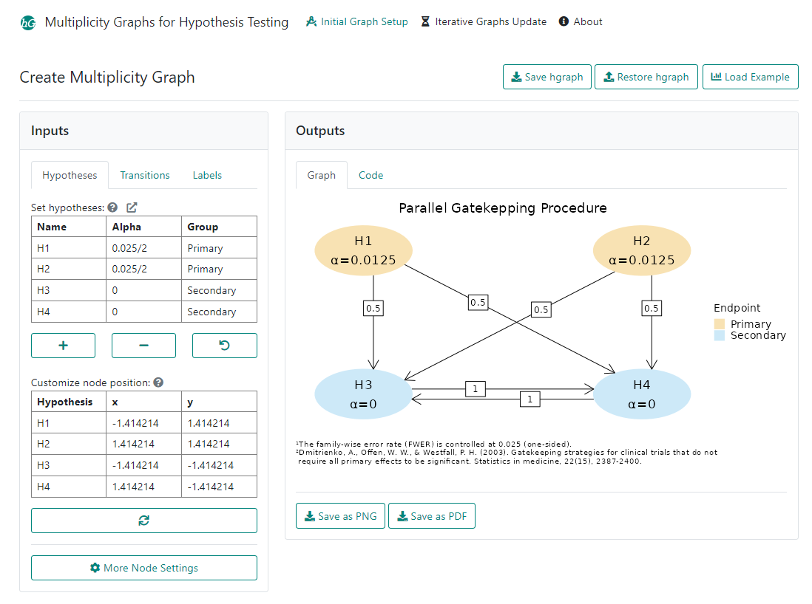

# gMCPShiny 

<!-- badges: start -->
[](https://github.com/Merck/gMCPShiny/actions/workflows/R-CMD-check.yaml)
[](https://app.codecov.io/gh/Merck/gMCPShiny?branch=main)
[](https://rinpharma.shinyapps.io/gmcp/)
<!-- badges: end -->

A Shiny app for graphical multiplicity control, the application interface allows users create a multiplicity graph with customized settings for hypothesis nodes, transition edges and labels, the iterative graphs can be automatically updated based on decisions of each hypothesis.

## Installation

```r
# The easiest way to get gMCPShiny is to install:
install.packages("gMCPShiny")

# Alternatively, install development version from GitHub:
# install.packages("remotes")
remotes::install_github("Merck/gMCPShiny")
```

## Execution

To run the app locally:

```r
gMCPShiny::run_app()
```


User can create and customize the multiplicity graph design for protocol development using `Initial Graph Setup` tab, and explore how the graph components (hypothesis rejection, transition weights) are updated using `Iterative Graph Update` tab. 

## Deployed Instances

### Production version

- <https://rinpharma.shinyapps.io/gmcp/> (faster and more scalable access)
- <https://gmcp.shinyapps.io/prod/>

### Development version

- <https://gmcp.shinyapps.io/devel/>
